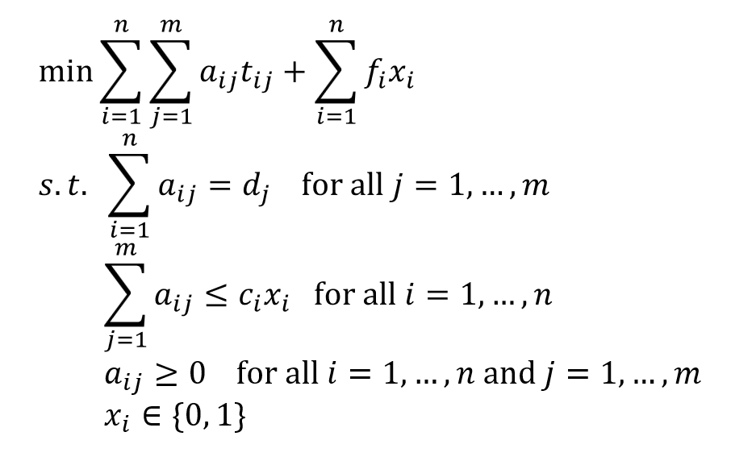

# Capacitated Facility Location Problem solver

Let's say that you want to satisfy a set of customers, each with a specific daily demand. For that you can build facilities in some locations, each with a construction cost, daily capacity, and a transportation cost for each customer.\
What facilities should you build, and what fraction of the demand of each customer should be satisfied by each facility, to minimize the overall construction cost and transportation cost?\
This problem is called the Capacitated Facility Location Problem (CFLP), and solving it can be a game changer for making decisions in this kind of situation.\
In this repository we solve it using constraint programming in Python (OR-Tools library).

The mathematical model is as follows:\

$x_{i}$ says if yes or no we decide to build the facility i\
$a_{ij}$ is how much demand of customer $j$ we satisfy with facility $i$\
$t_{ij}$ is the transportation cost for one unit of demand between facility $i$ and customer $j$\
$d_{j}$ is the daily demand of the customer $j$\
$c_{i}$ is the daily capacity of the facility $i$\

The program produces a plot similar to:\
\
Red dots represent facilities (bright if built), with a size proportional to daily capacity\
Blue dots represents customers, with a size proportional to daily demand\
Black lines represents assigned demand, with a size proportional to the amount
